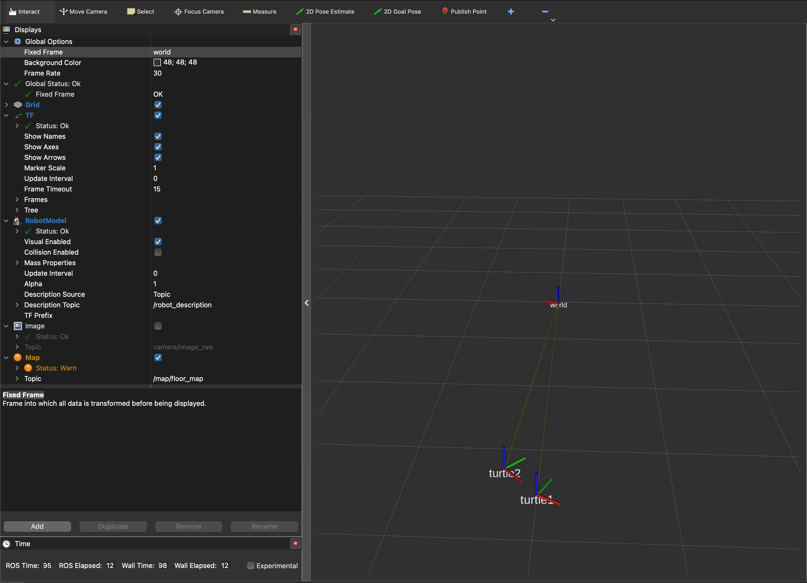
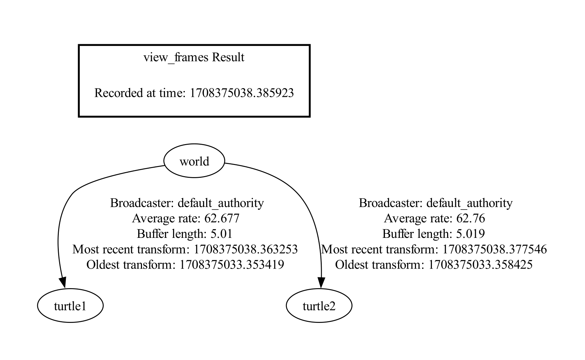

Command Line Tools
==================

There are a number of tools to help you debug tf related problems. Most of them are located inside the bin directory or the scripts directory. This page gives a description of each tool, and explains what type of problems you can resolve with each tool.

Frame Poses
-----------

1. tf2_echo
^^^^^^^^^^^
tf2_echo is the simplest tool to look at the numeric values of a specific transform. tf2_echo takes two arguments: the source frame and the target frame. The output of tf2_echo is the target frame in comparison to the source frame. E.g. to get the transformation from turtle1 to turtle2, set up the turtlesim example with:

.. code-block:: bash

   git clone https://github.com/ros/geometry_tutorials.git -b ros2

Then build and source in each terminal:

.. code-block:: bash

   colcon build && . install/setup.zsh

Then:

.. code-block:: bash

  ros2 launch turtle_tf2_py turtle_tf2_demo.launch.py

Also in a separate terminal, begin controlling the robot:

.. code-block:: bash

  ros2 run turtlesim turtle_teleop_key

Now using tf2_echo to take a look at the different transformations occuring between two frames

.. code-block:: bash

  ros2 run tf2_ros tf2_echo turtle1 turtle2

The expected output looks something like this:

.. code-block:: bash

   At time 1253924110.083
    - Translation: [-1.877, 0.415, 0.000]
    - Rotation: in Quaternion [0.000, 0.000, -0.162, 0.987]
            in RPY [0.000, -0.000, -0.325]
   At time 1253924111.082
    - Translation: [-1.989, 0.151, 0.000]
    - Rotation: in Quaternion [0.000, 0.000, -0.046, 0.999]
            in RPY [0.000, -0.000, -0.092]

2. RViz2
^^^^^^^^
Run `rviz2` with `tf` enabled and begin viewing frames to see transforms

TF tree inspection
------------------
1. Viewing TF trees
^^^^^^^^^^^^^^^^^^^
1.1 Save as a file by view_frames
~~~~~~~~~~~~~~~~~~~~~~~~~~~~~~~~~
View frames can generate a pdf file with a graphical representation of the complete tf tree. It also generates a number of time-related statistics. To run view frames, type:

.. code-block:: bash

   ros2 run tf2_tools view_frames

In the current working folder, you should now have a file called "frames_$(data)_$(time).pdf". Open the file, you should see something like this:

Fields
~~~~~~
  * Recorded at time: shows the absolute timestamp when this graph was generated.
  * Broadcaster: gives the name of the node that broadcasted the corresponding transform.
  * Average rate: gives the average frequency at which the broadcaster sent out the corresponding transform. Note that this is an average, and does not guarantee that the broadcaster was sending transforms the whole time.
  * Buffer length: tells you how many seconds of data is available in the tf buffer. When you run view frames without specifying a node, this buffer length should be about 5 seconds.
  * Most recent transform: states how long ago the last transform was received. This is the time delay of a transform.
  * Oldest transform: states how long ago the first transform was received.

1.2 Query a running node
~~~~~~~~~~~~~~~~~~~~~~~~
If a specific node is having trouble its exact data can be queried using the following command:

.. code-block:: bash

  ros2 run tf2_tools view_frames --node=NODE_NAME

1.3 Dynamically inspect during runtime
~~~~~~~~~~~~~~~~~~~~~~~~~~~~~~~~~~~~~~
`rqt_tf_tree <https://github.com/ros-visualization/rqt_tf_tree/tree/master>`_  provides a GUI to inspect tf tree during runtime.

  A simple tree from the tutorial in 1. tf2_echo looks like:

   .. image:: images/rqt_tf_tree.png

2. tf2_monitor
^^^^^^^^^^^^^^
tf2_monitor can give you a lot of detailed information about a specific transformation you care about. The monitor will break down the chain between two frames into individual transforms, and provide statistics about timing, broadcasters, etc.

E.g. you want more information about the transformation between the frame "turtle1" and the frame "turtle2", simply type:

.. code-block:: bash

   ros2 run tf2_ros tf2_monitor turtle1 turtle2

The output should look something like this:

.. code-block:: bash

  RESULTS: for turtle1 to turtle2
  Chain is: turtle2
  Net delay     avg = 0.00296015: max = 0.0239079

  Frames:
  Frame: turtle2, published by <no authority available>, Average Delay: 0.00385465, Max Delay: 0.00637698

  Broadcasters:
  Node: /turtle1_tf_broadcaster 40.01705 Hz, Average Delay: 0.0001427 Max Delay: 0.0003479
  Node: /turtle2_tf_broadcaster 40.01705 Hz, Average Delay: 0.0001515 Max Delay: 0.00034

Each of these frames can be published by a different broadcaster.

3 TF Manipulation
-----------------

static_transform_publisher
^^^^^^^^^^^^^^^^^^^^^^^^^^

Publish a static coordinate transform to tf2 using an x/y/z offset in meters and yaw/pitch/roll in radians. (yaw is rotation about Z, pitch is rotation about Y, and roll is rotation about X).

.. code-block:: bash

  ros2 run tf2_ros static_transform_publisher [--x X] [--y Y] [--z Z] [--yaw Yaw] [--pitch Pitch] [--roll Roll] --frame_id Frame --child_frame_id Child_Frame

Static_transform_publisher can also publish a static coordinate transform to tf2 using an x/y/z offset in meters and quaternion.
Unlike in tf, there is no period argument, and a latched topic is used.

.. code-block:: bash

  ros2 run tf2_ros static_transform_publisher [--x X] [--y Y] [--z Z] [--qx QX] [--qy QY] [--qz QZ] [--qw QW] --frame_id Frame --child_frame_id Child_Frame

Static_transform_publisher is designed both as a command-line tool for manual use, as well as for use within roslaunch files for setting static transforms. For example:

.. code-block:: yaml

  <launch>
    <node pkg="tf2_ros" type="static_transform_publisher" name="link1_broadcaster" args="1 0 0 0 0 0 1 link1_parent link1" />
  </launch>
